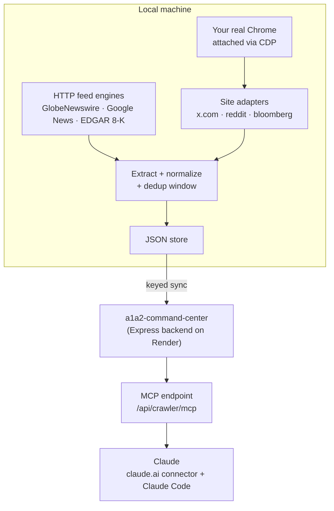

# andy2_crawler

A credentialed web-data pipeline with an **MCP interface**: it turns X (Twitter), Reddit, market newswires, and SEC EDGAR filings into one deduplicated, queryable research feed — which Claude reads directly over the Model Context Protocol.

Built to answer one question every morning: *what's in my feeds that isn't priced in yet?*

## How it works



Two acquisition paths feed one store:

1. **Browser path** — attaches to your own logged-in Chrome via the DevTools Protocol and reads the feeds you already have access to, through per-site adapters with stall detection and bounded runs.
2. **Feed path** — plain HTTP engines for GlobeNewswire, Google News RSS, and SEC EDGAR (8-K filings). No browser needed.

Everything is normalized into one schema, deduplicated over a rolling window, and synced to a backend whose MCP server makes the corpus searchable from any Claude surface — ask claude.ai or Claude Code "what did the feed pick up on $XYZ this week?" and it queries this store.

## Design decisions

- **CDP session reuse instead of login automation.** The crawler never sees or stores credentials — it attaches to your existing Chrome profile, so 2FA, cookies, and session state stay exactly where they belong. This is the difference between "automation that keeps working" and "automation that breaks on every login challenge."
- **One adapter per site.** Each source implements a small adapter interface (`src/sites/`); supporting a new site is one file, not a refactor.
- **Layered secret resolution.** The backend ingest key resolves env var → gitignored local file → config, and is never committed. The repo history is gitleaks-clean.
- **Polite by construction.** Randomized pacing, page and character budgets, per-run caps, and age cutoffs are first-class config — this is a personal research tool reading feeds its owner already has access to, and it behaves like one.
- **Fixtures over live tests.** Site extractors are developed against synthetic HTML fixtures (`src/fixtures/`), so parser changes are testable offline.

## Usage

See [USAGE.md](USAGE.md) for setup and configuration. Quick version:

```sh
npm install
npx playwright install
npm start            # crawl targets from crawler.config.json
```

Config presets (`crawler.config.*.json`) cover full runs, short smoke runs, and feeds-only runs.

## Stack

TypeScript · Playwright + Chrome DevTools Protocol · RSS/Atom + SEC EDGAR · Node/Express + MongoDB (backend) · Model Context Protocol
