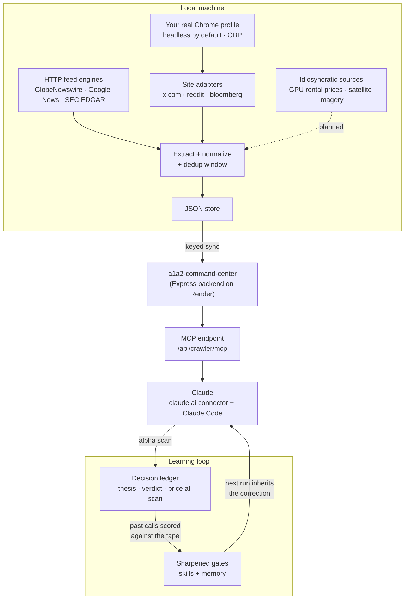

# andy2_crawler

A credentialed web-data pipeline with an **MCP interface**: it turns X (Twitter), Reddit, market newswires, and SEC EDGAR filings into one deduplicated, queryable research feed — which Claude reads directly over the Model Context Protocol.

Built to answer one question every morning: *what's in my feeds that isn't priced in yet?*

## How it works


```mermaid
flowchart TD
    subgraph local [Local machine]
        A["Your real Chrome profile<br/>headless by default · CDP"] --> B["Site adapters<br/>x.com · reddit · bloomberg"]
        C["HTTP feed engines<br/>GlobeNewswire · Google News · SEC EDGAR"] --> D
        B --> D["Extract + normalize<br/>+ dedup window"]
        P["Idiosyncratic sources<br/>GPU rental prices · satellite imagery"] -.planned.-> D
        D --> E["JSON store"]
    end
    E -->|keyed sync| F["a1a2-command-center<br/>(Express backend on Render)"]
    F --> G["MCP endpoint<br/>/api/crawler/mcp"]
    G --> H["Claude<br/>claude.ai connector + Claude Code"]

    subgraph learn [Learning loop]
        I["Decision ledger<br/>thesis · verdict · price at scan"]
        J["Sharpened gates<br/>skills + memory"]
        I -->|past calls scored<br/>against the tape| J
    end
    H -->|alpha scan| I
    J -->|next run inherits<br/>the correction| H
```

The browser path runs **headless by default** — a crawl is background work, so it
never opens a window or takes your screen. When you do want to watch it, the window
can be told to sit behind everything else instead of on top. See
[Running invisibly](#running-invisibly).

Two acquisition paths feed one store:

1. **Browser path** — attaches to your own logged-in Chrome via the DevTools Protocol and reads the feeds you already have access to, through per-site adapters with stall detection and bounded runs.
2. **Feed path** — plain HTTP engines for GlobeNewswire, Google News RSS, and SEC EDGAR (8-K filings). No browser needed.

Everything is normalized into one schema, deduplicated over a rolling window, and synced to a backend whose MCP server makes the corpus searchable from any Claude surface — ask claude.ai or Claude Code "what did the feed pick up on $XYZ this week?" and it queries this store.

The third path is the one that compounds. Every alpha scan writes its reasoning back as a
**decision** — thesis, verdict, and the price at the moment of the call — so the corpus
records not just what the feed said but what was concluded and what it was worth. Later
scans read that ledger and score themselves against the tape:

> *"this is the same InP thread the scanner mis-killed on 2026-07-20 at $48.83, and AXTI
> has since run +44.9% (vs SMH +0.3%) — the edge was real and was missed"*

A miss with a timestamp and a price is a gradient. Those corrections are what get promoted
into the scan skill's gates and into durable memory, so the next run inherits them rather
than relearning them.

## Design decisions

- **CDP session reuse instead of login automation.** The crawler never sees or stores credentials — it attaches to your existing Chrome profile, so 2FA, cookies, and session state stay exactly where they belong. This is the difference between "automation that keeps working" and "automation that breaks on every login challenge."
- **One adapter per site.** Each source implements a small adapter interface (`src/sites/`); supporting a new site is one file, not a refactor.
- **Invisible by default.** The crawl runs headless and never steals focus. Headless Chrome normally advertises itself as `HeadlessChrome/<version>` in its user-agent — the single loudest automation tell — so the launcher rewrites that to the ordinary `Chrome/<version>` string. Its client hints are already clean and are deliberately left untouched, since a UA that disagrees with its own `Sec-CH-UA` header is a stronger signal than either one alone.
- **Layered secret resolution.** The backend ingest key resolves env var → gitignored local file → config, and is never committed. The repo history is gitleaks-clean.
- **Polite by construction.** Randomized pacing, page and character budgets, per-run caps, and age cutoffs are first-class config — this is a personal research tool reading feeds its owner already has access to, and it behaves like one.
- **Fixtures over live tests.** Site extractors are developed against synthetic HTML fixtures (`src/fixtures/`), so parser changes are testable offline.

## Running invisibly

Two settings under `chrome` control whether the crawler ever touches your screen:

```json
"chrome": { "headless": true, "windowMode": "background" }
```

| Setting | Effect |
| --- | --- |
| `headless: true` *(default)* | No window at all. Same logged-in profile, same behaviour — it just runs in the background. |
| `windowMode` *(when headless is `false`)* | `background` *(default)* drops the window to the bottom of the z-order and hands focus straight back, so it sits under everything else; `minimized` sends it to the taskbar; `normal` is a foreground window that raises itself on every page load, for when you want to watch. |

Two details make this work rather than merely look like it works:

- **Focus is not stolen back.** The engine used to call `bringToFront()` before every
  navigation, which yanks the window over whatever you are doing on each page load.
  It is now skipped whenever the window is deliberately parked.
- **Backgrounded windows are not throttled.** Chrome treats a covered window as
  occluded and slows its timers and renderers, which stalls infinite-scroll feeds.
  The non-`normal` modes pass the flags that keep it running at full speed.

Verify any mode end to end — fingerprint plus a real logged-in page load — with:

```sh
npx tsx src/scripts/test-headless.ts [configPath]
```

## Adding a source

New sources plug into whichever of the two paths fits, and everything downstream —
dedup, budgets, the store, the backend sync, the MCP tools — comes for free because
every source normalizes into the same snapshot schema.

- **HTTP path** (`src/feeds/`) — anything with a feed or a JSON/XML endpoint. Implement
  one function returning `FeedItem[]` (`url`, `title`, `text`, `author`, `timestamp`,
  `metrics`), register it in the feed engine, add a toggle under `feeds` in the config.
  No browser, seconds per run.
- **Browser path** (`src/sites/`) — anything that needs a login or renders client-side.
  Implement `SiteAdapter` (`extractBase`, `discoverExpandTargets`, `paginationStrategy`)
  and add it to `src/sites/index.ts`. Character budgets, stall detection, age cutoffs
  and post-level expansion are handled by the engine.

Candidates that fit this shape, roughly easiest first:

| Source | Path | Notes |
| --- | --- | --- |
| **More EDGAR form types** — 10-K, 10-Q, S-1, 13F/13D | HTTP, config only | *Not a new source.* The EDGAR engine already pulls filings; these are the same pipeline with different form types, so it is mostly widening `feeds.edgar.formTypes` and teaching the parser the extra item codes. Cheapest real win. |
| **Annual reports / investor-relations decks** | HTTP + parse | PDFs, so they need a text-extraction step before becoming a `FeedItem`. Slower-moving — a weekly cadence rather than the 15-minute feed pull. |
| **Earnings-call transcripts, FRED macro series, non-US filings (SEDAR, RNS)** | HTTP | Same shape as EDGAR — a fetcher plus a normalizer. |
| **Custom GPU rental price tracker** (sibling project) | direct import | The genuinely idiosyncratic one, and the reason this section exists. |
| **Satellite imagery / other alt-data** | custom | Derived observations rather than documents — same shape question as the GPU tracker. |

The last two are the interesting ones, because they are the only proposals here that are
**not** documents. Everything above them is text with a timestamp and a URL, which the
existing schema already handles. A rental-price curve or a parking-lot count is a numeric
series, and the shape question is worth deciding deliberately rather than by default:

- **Normalize into snapshots** — each observation becomes a record with the numbers in
  `metrics`. Cheapest, and dedup/MCP/search work immediately. But a time series stored as
  thousands of one-row text documents is awkward to aggregate.
- **Sibling collection, joined at the MCP layer** — keeps the series in a shape you can
  actually query (ranges, deltas, correlations) and lets the scan ask *"did the tape move
  against this idiosyncratic signal?"*, which is exactly the question the decision ledger
  above is built around.

Rule of thumb: if it is **text with a timestamp and a source URL**, put it in the snapshot
store and inherit the whole pipeline. If it is **a number series**, prefer the sibling
collection — forcing metrics into a text schema costs more than it saves.


## Usage

See [USAGE.md](USAGE.md) for full setup and configuration. Quick version:

```sh
npm install          # requires Google Chrome — the crawler drives real Chrome, not Playwright's bundled browsers
# edit crawler.config.json (targets, site budgets, backend sync)
npm run login        # opens the automation Chrome profile — sign in to X/Reddit once
npm run crawl        # one-shot crawl of the configured targets
npm run agent        # or: always-on daemon that takes remote jobs via the backend
```

Config presets (`crawler.config.*.json`) cover full runs, short smoke runs, and feeds-only runs; `npm run feeds` pulls the news/EDGAR feeds with no browser at all.

Targeted X Latest searches use the same browser and queue. The saved `hynix-watch` profile runs with hourly gathers, with 30 posts per query independent of timeline budgets. See [X search tools and monitoring workflow](docs/X-SEARCH.md), [argument schemas](docs/crawler-search-tool-schemas.json), and [live acceptance results](docs/hynix-watch-acceptance.md).

## Stack

TypeScript · Playwright + Chrome DevTools Protocol · RSS/Atom + SEC EDGAR · Node/Express + MongoDB (backend) · Model Context Protocol
